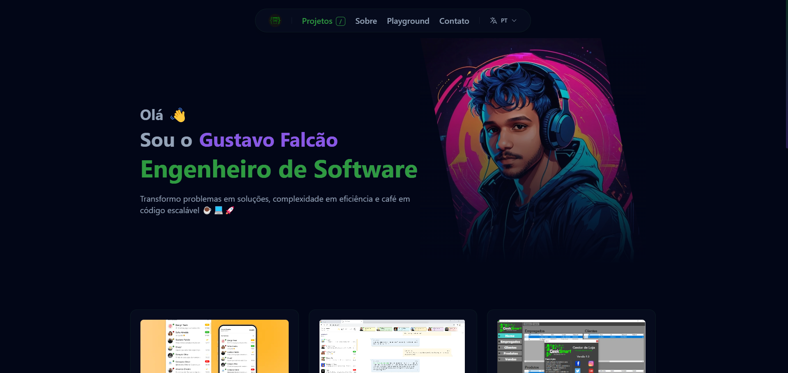

# [🚀 Portfolio - Gustavo Falcão](https://gustavofalcao1.github.io/)

A modern, animated, and responsive personal portfolio website built with **React**, **TypeScript**, and **Tailwind CSS**, showcasing technical skills, projects, and personality through elegant visual effects and multilingual support.



---

## ✨ Features

### 🌐 Internationalization (i18n)
- 🇵🇹 Portuguese (PT)
- 🇬🇧 English (EN)
- 👽 Martian (MAR) — Just for fun!

### 💬 Interactive Chat Interface
- Contact form designed as a chat window
- Smart replies based on keyword detection
- Responsive and animated UI

### 🎨 Visual Effects
- Glassmorphism design
- Matrix-style background animations
- Smooth page and element transitions
- Dynamic hover and entrance effects

### 📱 Responsive Design
- Fully mobile-first layout
- Adaptive structure for tablet and desktop

### 🛠️ Dynamic & Modular Content
- Project portfolio showcase
- Language and theme toggles
- Interactive "Play" zone
- Reusable and modular components

### ⚡ Performance Optimization
- WebP image support for faster loading
- Progressive loading techniques
- Clean, scalable component structure

---

## 🔧 Tech Stack

- **Frontend:** React + TypeScript
- **Styling:** Tailwind CSS
- **State Management:** React Hooks, Context API
- **Data Format:** JSON (content and translations)
- **Build Tooling:** Vite (if applicable)

---

## 📁 Project Structure

```
(root)/
├── public/
│   ├── img/           # Static image assets and project screenshots
│   ├── data/          # JSON files for projects and content
│   ├── locale/        # Language translation JSON files
│   └── ...            # Favicon and other public assets
├── src/
│   ├── components/    # UI components
│   ├── hooks/         # Custom React hooks
│   ├── pages/         # Application page views
│   ├── App.tsx        # Root app component
│   └── index.tsx      # Main entry point
├── docs/              # Additional documentation
└── screenshots/       # Visual documentation assets
```

---

## 🚀 Getting Started

### 1. Clone the repository:
```bash
git clone https://github.com/gustavofalcao1/gustavofalcao1.github.io.git
cd gustavofalcao1.github.io
```

### 2. Install dependencies:
```bash
npm install
```

### 3. Start the development server:
```bash
npm start
```

### 4. Build for production:
```bash
npm run build
```

---

## 📚 Documentation

Refer to the guide below for managing content and multilingual support:

- [Translation Management](docs/translation-management.md)

---

## 📄 License

This project is licensed under the **MIT License**. See the [LICENSE](LICENSE) file for details.

---

## 👤 Author
**Gustavo Falcão**  
[GitHub @gustavofalcao1](https://github.com/gustavofalcao1)  
[LinkedIn](https://www.linkedin.com/in/gustavofalcao1)

---

## ⚠️ Notice

This is a **personal portfolio** intended for self-presentation purposes. All content (text, design, visuals) is the exclusive property of Gustavo Falcão. Unauthorized use or reproduction is prohibited.

---

