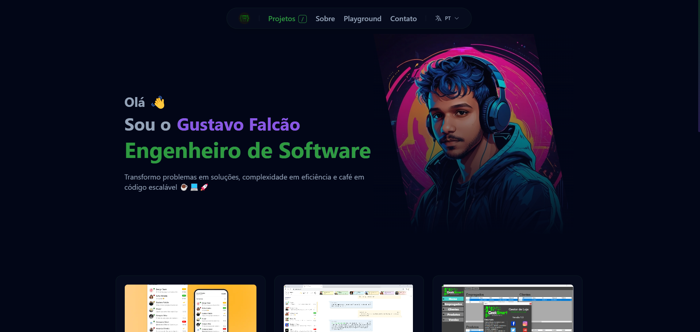

# 🚀 Portfolio - Gustavo Falcão

Modern and responsive personal portfolio website, built with React, TypeScript, and Tailwind CSS.



## ✨ Features

- 🌐 Advanced Internationalization (i18n):
  - 🇧🇷 Portuguese (PT-BR)
  - 🇬🇧 English (EN)
  - 👽 Martian (MAR) - For the fun!
- 🎨 Visual Effects:
  - Glassmorphism UI
  - Matrix background effects
  - Smooth transitions
  - Dynamic hover effects
  - Responsive layouts
- 📱 Responsive Design:
  - Mobile-first approach
  - Tablet optimization
  - Desktop enhancement
- 🛠️ Dynamic Content:
  - Project showcase
  - Interactive sections
  - Language selection
  - Play section
- 🎯 Performance:
  - Optimized assets (WebP images)
  - Progressive loading
  - Clean code structure

## 🔧 Technical Stack

- React with TypeScript
- Tailwind CSS for styling
- JSON for data management
- Custom animations
- React Hooks for state management

## 📁 Project Structure

```
(root)/
├── public/
│   ├── img/           # Images and visual resources including project works
│   ├── data/          # JSON data files
│   ├── locale/        # Language translation files
│   └── ...            # Other static assets
├── src/
│   ├── components/    # Reusable UI components
│   ├── hooks/         # Custom React hooks
│   ├── pages/         # Application pages
│   ├── App.tsx        # Main application component
│   └── index.tsx      # Application entry point
├── docs/              # Documentation
└── screenshots/       # Project screenshots
```

## 🚀 How to Run

1. Clone the repository:
```bash
git clone https://github.com/gustavofalcao1/gustavofalcao1.github.io.git
```

2. Install dependencies:
```bash
npm install
```

3. Start the development server:
```bash
npm start
```

4. Build for production:
```bash
npm run build
```

## 📚 Documentation

For information on how to manage texts and languages in the application, please check the [Translation Management Guide](docs/translation-management.md).

## ⚠️ Copyright

This is a personal portfolio. All rights reserved. The code and content of this project are the exclusive property of Gustavo Falcão.

## 📫 Contact

- LinkedIn: [Gustavo Falcão](https://www.linkedin.com/in/gustavofalcao1)
- GitHub: [@gustavofalcao1](https://github.com/gustavofalcao1)

## 📝 License

This project is under the MIT license. See the [LICENSE](LICENSE) file for more details.